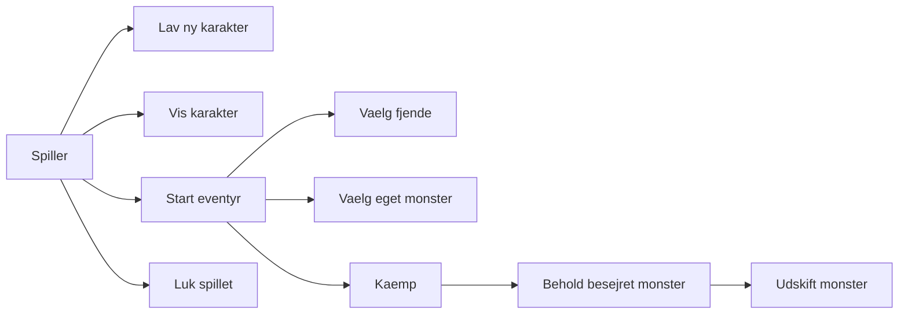
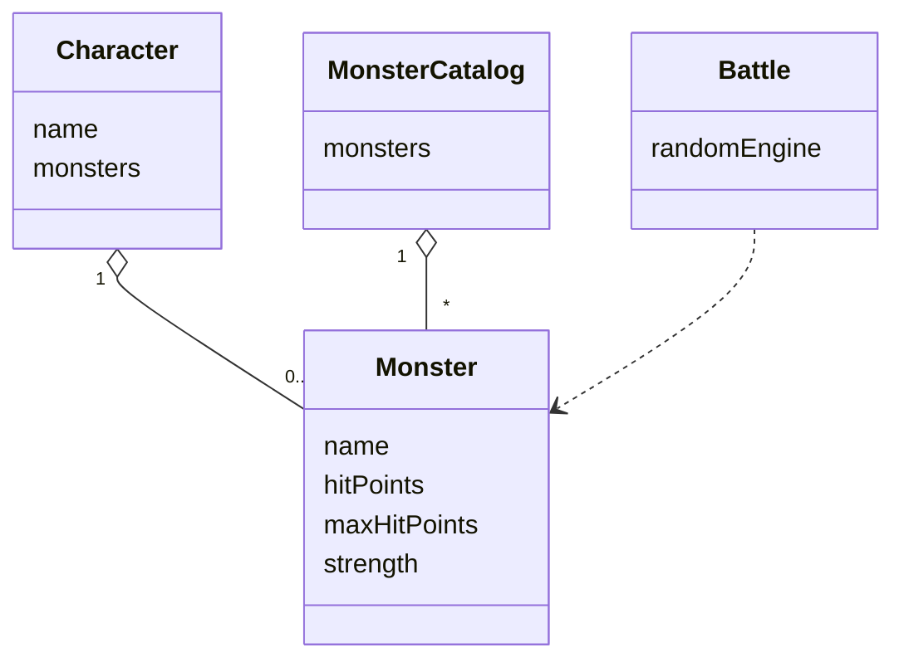
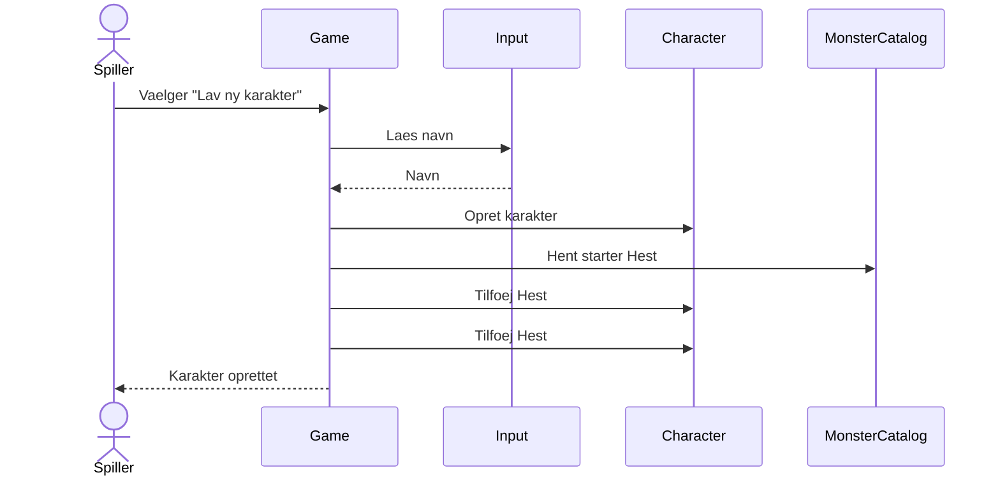
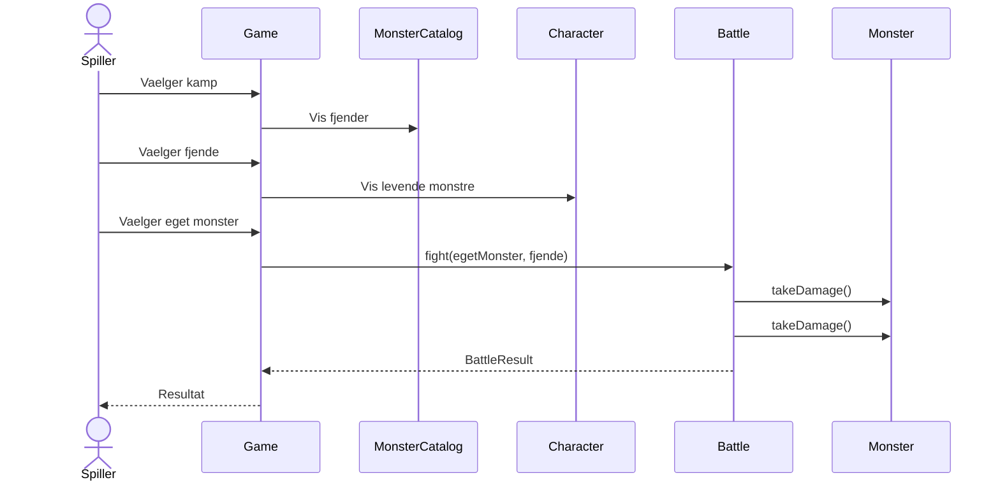
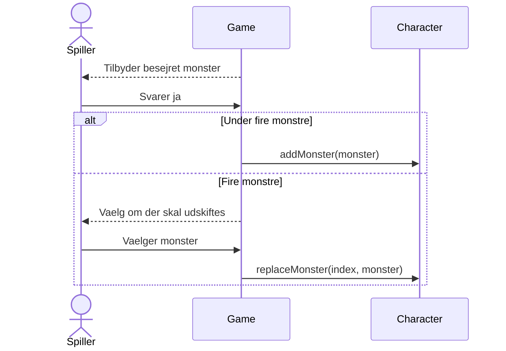
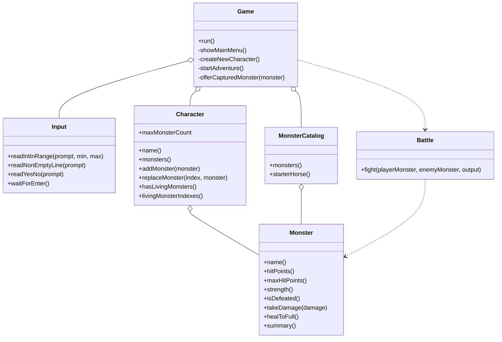

# Portfolio - Monster Adventure

## Gennemgang af foerste iteration

Foerste iteration implementerer et simpelt terminalspil med en karakter, en liste af egne monstre og kampe mod fjendtlige monstre. Spillet gemmer ikke data mellem koerelser, hvilket passer til kravene for iterationen.

Udviklingsflowet er holdt objektorienteret: foerst er domaeneklasserne for monster og karakter oprettet, derefter kataloget med tilgaengelige monstre, kampmotoren og til sidst terminalmenuerne.

Nuvaerende status:

- Spilleren kan oprette en ny karakter med et navn.
- En ny karakter starter med to Hest.
- Karakteren kan have op til fire monstre.
- Spilleren kan starte et eventyr, vaelge en fjende og vaelge et levende monster til kampen.
- Kampen vaelger tilfaeldigt hvem der angriber foerst, hvorefter angrebene skifter.
- Hvis et eget monster besejres, og karakteren stadig har levende monstre, sendes et nyt ind mod samme fjende.
- Hvis fjenden besejres, kan spilleren beholde den.
- Hvis karakteren allerede har fire monstre, kan spilleren udskifte et eksisterende monster.
- Hvis alle egne monstre besejres, vender spillet tilbage til hovedmenuen.
- Spilleren kan lukke spillet fra hovedmenuen.

## Beskrivelse af nuvaerende system

Systemet er et C++17 terminalprogram uden eksterne biblioteker. `Game` styrer hovedmenuen og eventyret. `Input` validerer brugerinput. `MonsterCatalog` indeholder de tilgaengelige monstertyper. `Character` ejer spillerens monstre, mens `Battle` afvikler en kamp mellem to `Monster`-objekter.

## Use Case Diagram



Use cases:

- Lav ny karakter: Spilleren indtaster et navn, og karakteren starter med to Hest.
- Vis karakter: Spilleren ser karakterens monstre, hp og styrke.
- Start eventyr: Spilleren kan vaelge at kaempe eller vende tilbage.
- Vaelg fjende: Spilleren vaelger et monster fra monsterlisten.
- Vaelg eget monster: Spilleren vaelger et levende monster fra karakterens liste.
- Kaemp: Systemet afvikler kampen med tilfaeldig foerste angriber og skiftende ture.
- Behold besejret monster: Spilleren kan tage en besejret fjende.
- Udskift monster: Hvis karakteren har fire monstre, kan spilleren erstatte et monster.
- Luk spillet: Programmet afsluttes.

## Domain Model



## Sekvensdiagrammer

### Lav ny karakter



### Kamp



### Behold besejret monster



## UML - Class Diagram



## Git-log

Git-log kan indsattes i PDF'en med:

```bash
git log --oneline --decorate
```

## Git branching strategy

I denne foerste iteration bruges `master` som stabil hovedgren, fordi projektet er lille og arbejdet kun omfatter en enkelt samlet prototype. Ved senere iterationer bruges korte feature branches med navne som `feature/save-game` eller `feature/tests`, som merges tilbage i `master`, naar de bygger og opfylder kravene.

## Backlog

- Gem og indlaes karakterer mellem spilkoersler.
- Flere eventyrtyper og svaerhedsgrader.
- Bedre balance for hp og styrke.
- Mulighed for at helbrede monstre via en menu.
- Automatiske tests af domaeneklasser og kampregler.
